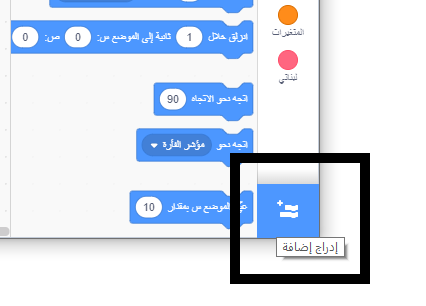
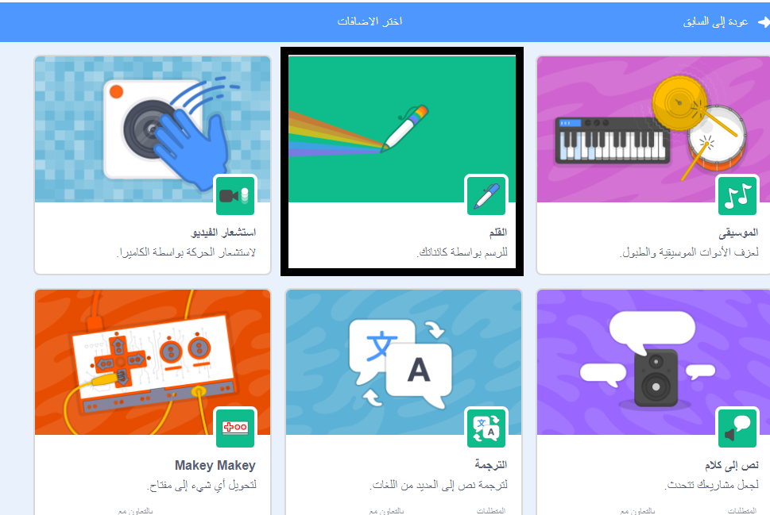
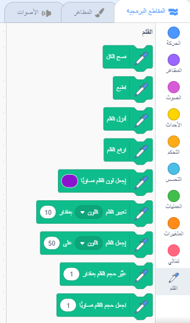

To use the Pen blocks in Scratch, you need to add the **Pen extension**.

+ اضغط على زر **إدراج إضافة** في الزاوية اليسرى السفلى.

+ انقر على ملحق **القلم** لإضافته.

+ يظهر قسم القلم في أسفل قائمة الكتل.

