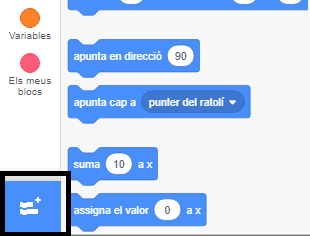
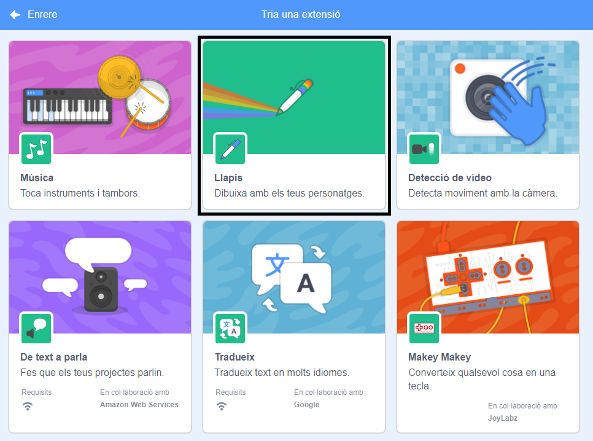
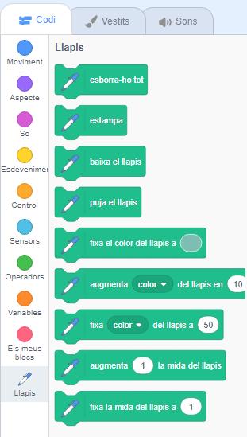

Per utilitzar els blocs del Llapis a Scratch, cal afegir l'**extensió Llapis**.

+ Fes clic al botó **Afegeix una extensió** de la part inferior esquerra.

+ Fes clic a l’extensió **Llapis** per afegir-la.

+ A continuació, apareix la secció Llapis a la part inferior del menú de blocs.

