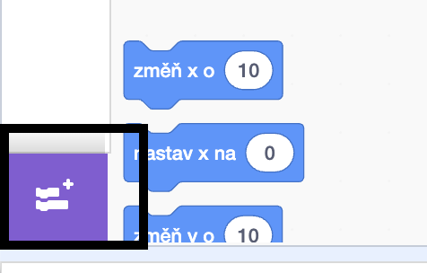
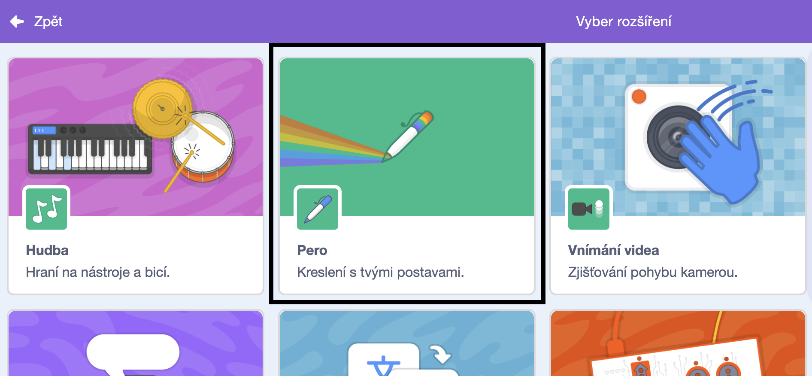
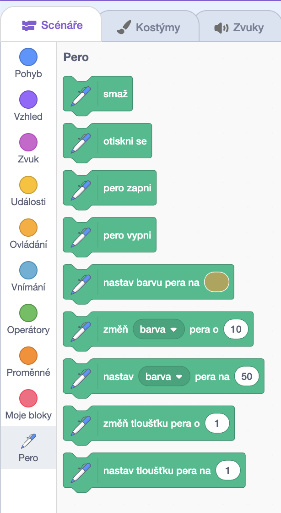

Pro použití bloků pera ve Scratchi, musíte přidat **rozšíření Pero**.

+ Klikni na tlačítko **Přidat rozšíření** v levém dolním rohu.

+ Kliknutím na rozšíření **Pero** jej přidáte.

+ V dolní části nabídky bloků se pak zobrazí sekce Pero.

