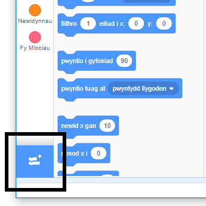
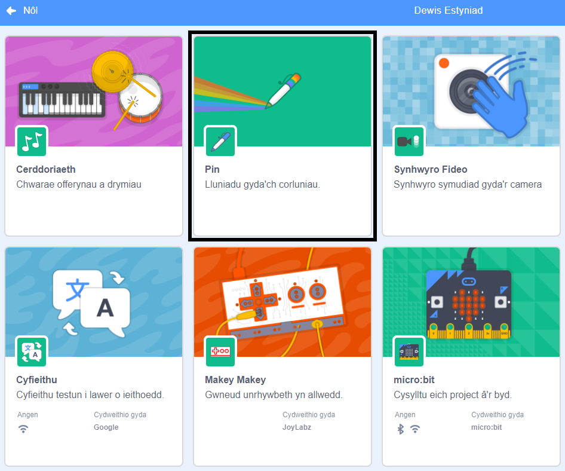
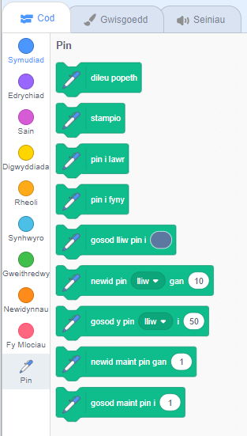

I ddefnyddio'r blociau Pin yn Scratch, mae angen i chi ychwanegu'r estyniad **Pen**.

+ Clicia'r botwm **Ychwanegu Estyniad** yng ngwaelod-chwith y dudalen.

+ Clicia'r estyniad **Pin** i'w ychwanegu.

+ Yna mae'r adran Pin yn ymddangos ar waelod y ddewislen blociau.

