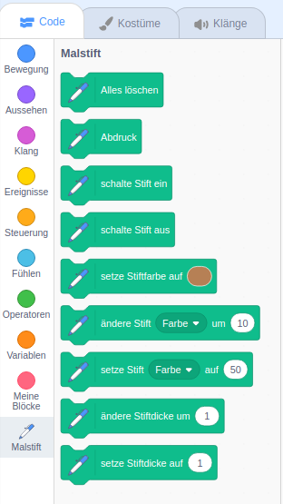

Um die Malstiftblöcke in Scratch zu verwenden, musst du die **Malstift-Erweiterung** hinzufügen.

+ Klicke auf die **Erweiterung hinzufügen** Schaltfläche in der unteren linken Ecke.

+ Klicke auf die Erweiterung **Malstift**, um sie hinzuzufügen.

+ Der Malstiftbereich wird dann unten im Blockmenü angezeigt.

