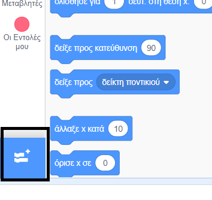
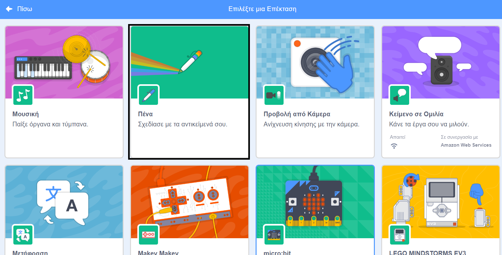
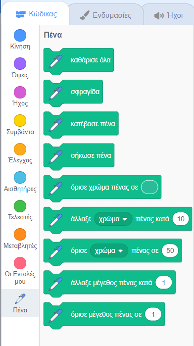

Για να χρησιμοποιήσεις τα μπλοκ πένας στο Scratch, πρέπει να προσθέσεις την επέκταση **"Πένα"**.

+ Κάνε κλικ στην **Προσθήκη επέκτασης** στην κάτω αριστερή γωνία.

+ Κάνε κλικ στην επέκταση **"Πένα"** για να την προσθέσεις.

+ Στη συνέχεια, η ενότητα "Πένα" εμφανίζεται στο κάτω μέρος του μενού των μπλοκ.

