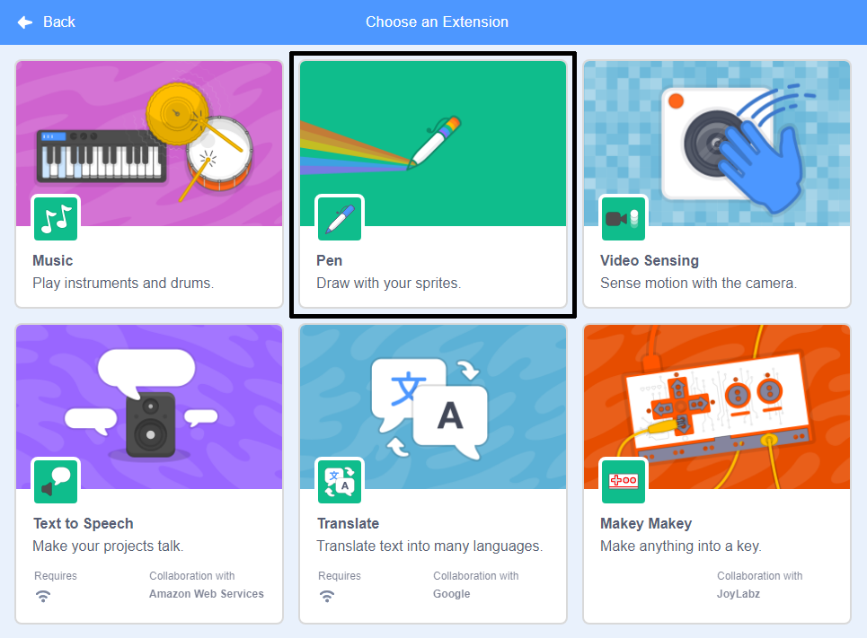

To use the Pen blocks in Scratch, you need add the **Pen extension**.

+ Click on the **Add extension** button in the bottom left-hand corner.

+ Click on the **Pen** extension to add it.

+ The Pen section then appears at the bottom of the blocks menu.

