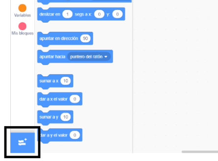
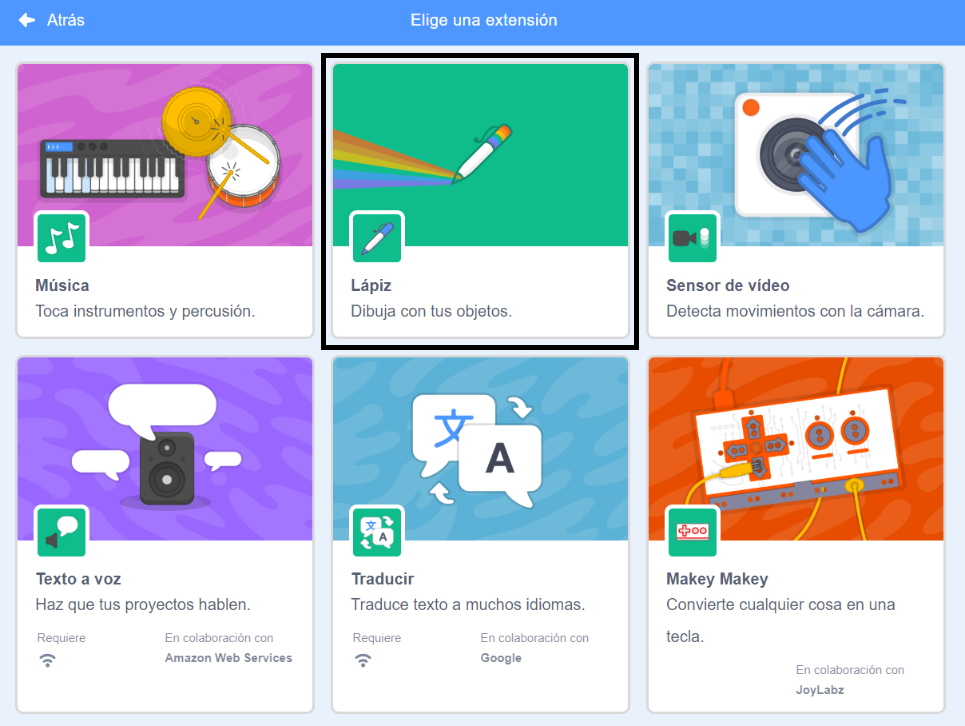
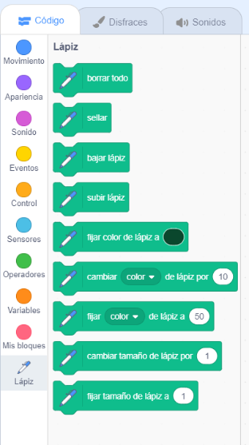

Para usar los bloques lápiz en Scratch, necesitarás añadir la **Extensión Lápiz**.

+ Haz click en el botón **Añadir Extensión** en la esquina inferior izquierda.

+ Haz click en la extensión **Lápiz** para añadirla.

+ La sección Lápiz aparecerá en la parte inferior del menú de bloques.

