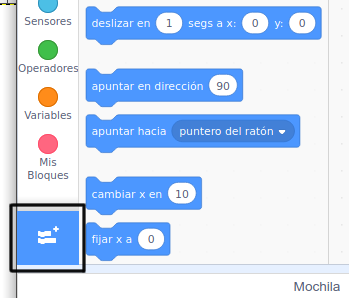
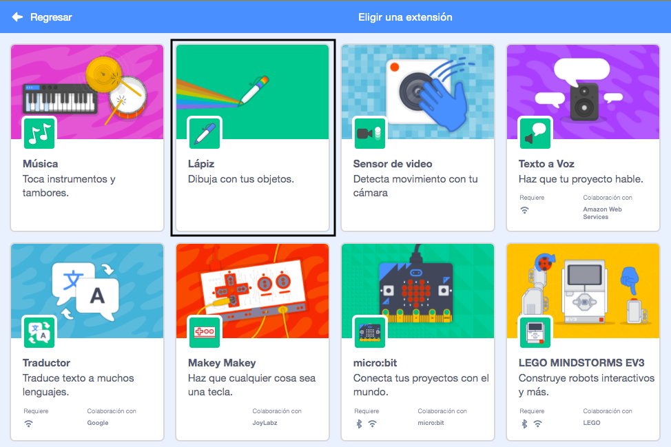
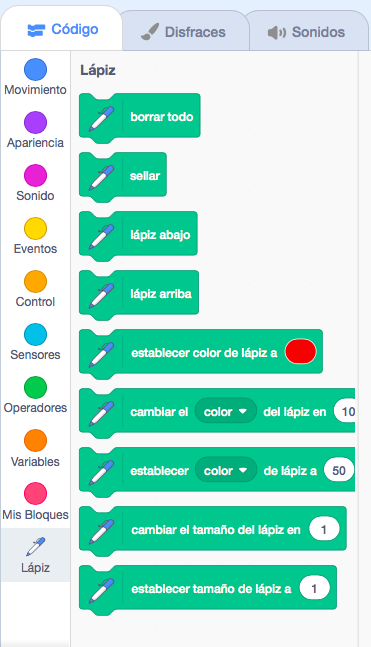

To use the Pen blocks in Scratch, you need to add the **Pen extension**.

+ Haz clic en el botón **Agregar extensión** en la esquina inferior izquierda.

+ Clic en la extensión **Lápiz** para agregarla.

+ La sección Lápiz ahora aparece en la parte inferior del menú de bloques.

