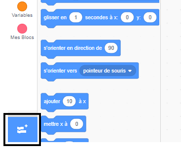
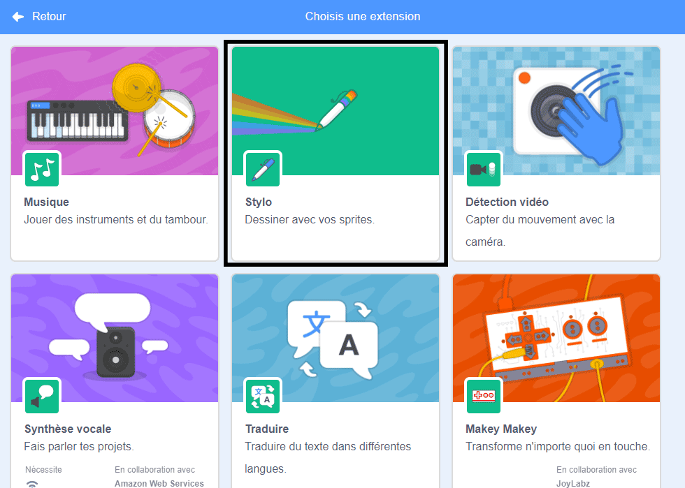
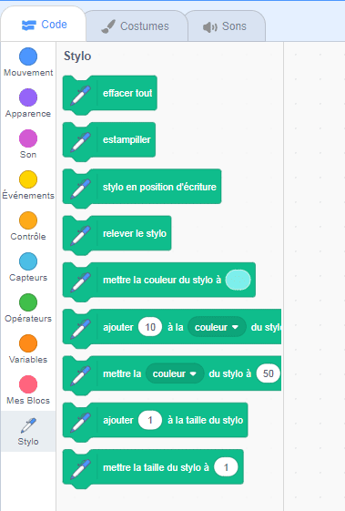

To use the Pen blocks in Scratch, you need to add the **Pen extension**.

+ Clique sur le bouton **Ajouter une extension** dans le coin en bas, à gauche.

+ Clique sur l'extension **Stylo** pour l'ajouter.

+ La section Stylo apparaît alors au bas du menu des blocs.

