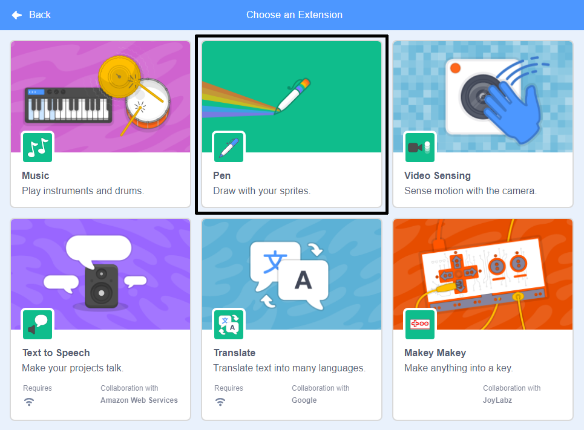
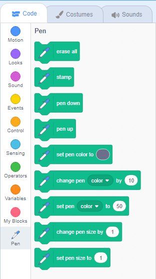

Scratch में पेन ब्लॉक्स का उपयोग करने के लिए, आपको **Pen extension** जोड़ना होगा।

+ नीचे बाएँ हाथ के कोने में **Add extension** बटन पर क्लिक करें।

+ इसे जोड़ने के लिए **Pen** एक्सटेंशन पर क्लिक करें।

+ Pen खंड तब ब्लॉक्स मेन्यू के नीचे दिखाई देता है ।

