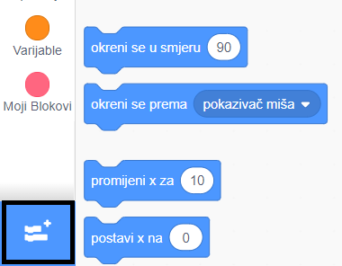
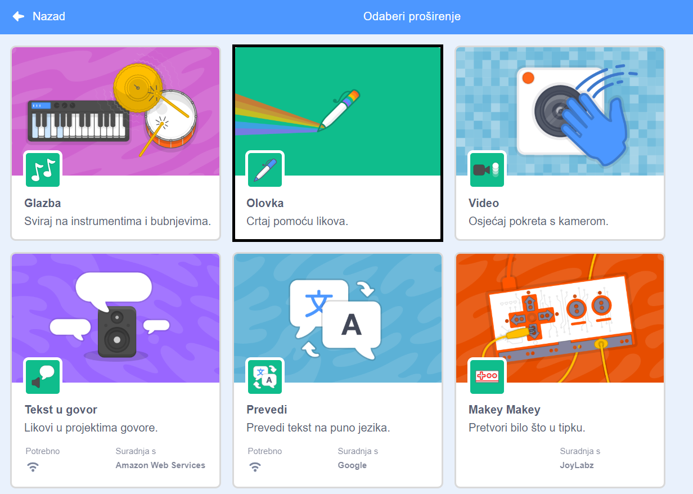
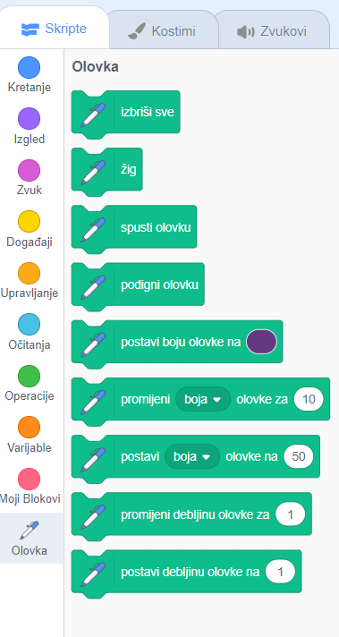

To use the Pen blocks in Scratch, you need to add the **Pen extension**.

+ Klikni na gumb **Dodaj proširenje** u donjem lijevom kutu.

+ Klikni na proširenje **Olovka**.

+ Kategorija Olovka će se zatim pojaviti na dnu izbornika kategorija.

