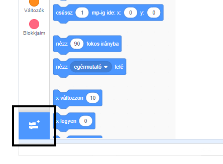
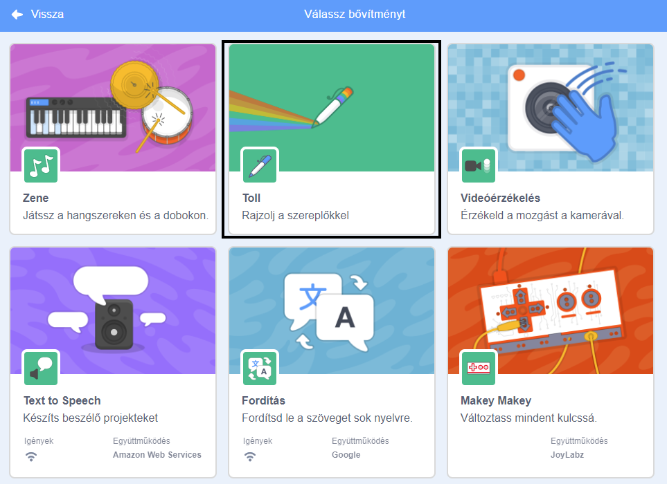
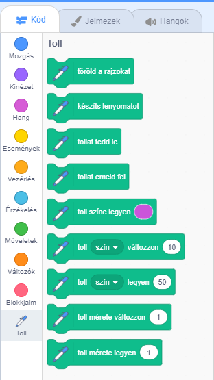

To use the Pen blocks in Scratch, you need to add the **Pen extension**.

+ Kattints a **Bővítmény hozzáadása** gombra a bal alsó sarokban.

+ Kattints a **Toll** bővítményre a hozzáadásához.

+ Ezután a Toll rész megjelenik a blokk menü alján.

