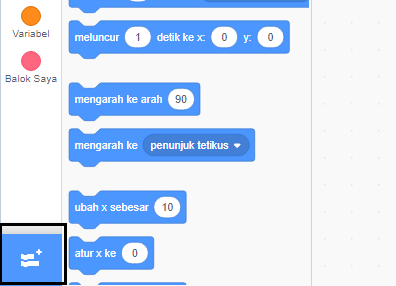
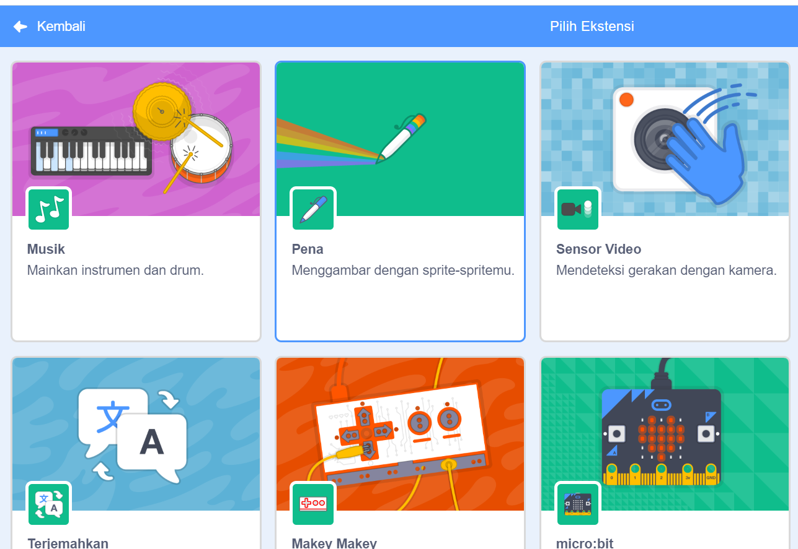
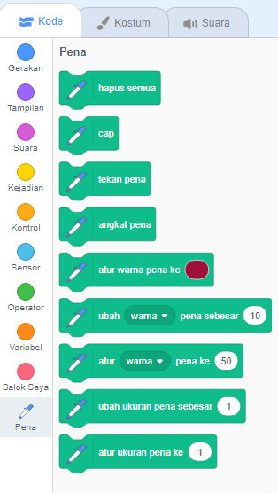

Untuk menggunakan blok Pena di Scratch, kamu perlu menambahkan ekstensi **Pena**.

+ Klik tombol **Tambahkan ekstensi** di sudut kiri bawah.

+ Klik pada ekstensi **Pena** untuk menambahkannya.

+ Bagian Pena kemudian muncul di bagian bawah menu blok.

