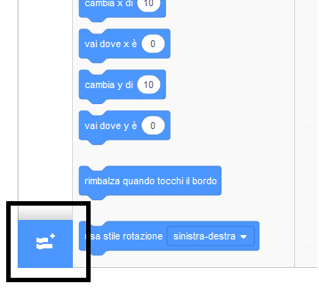
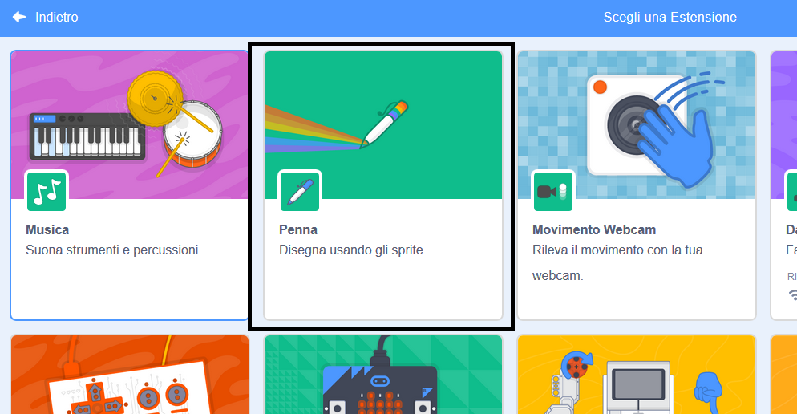

To use the Pen blocks in Scratch, you need to add the **Pen extension**.

+ Fai clic sul pulsante **Aggiungi estensione** nell'angolo in basso a sinistra.

+ Fare clic sull'estensione **Penna** per aggiungerla.

+ La sezione Penna viene visualizzata nella parte inferiore del menu dei blocchi.

