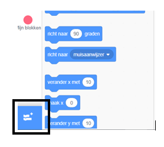
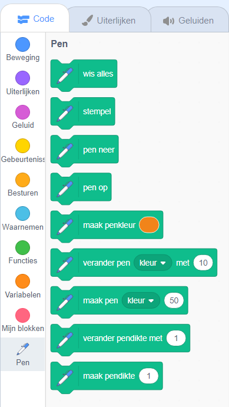

Als je de Penblokken in Scratch wilt gebruiken, moet je de uitbreiding **Pen** toevoegen.

+ Klik op de knop **Voeg een uitbreiding toe** in de linkerbenedenhoek.

+ Klik op de **Pen** uitbreiding om deze toe te voegen.

+ Het gedeelte Pen wordt vervolgens onder aan de menu blokken weergegeven.

