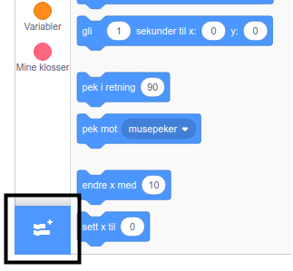
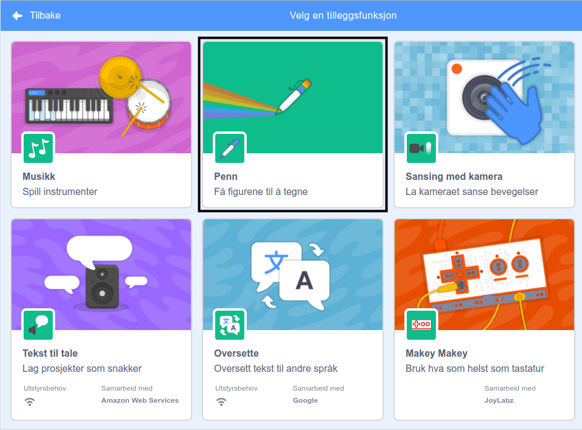
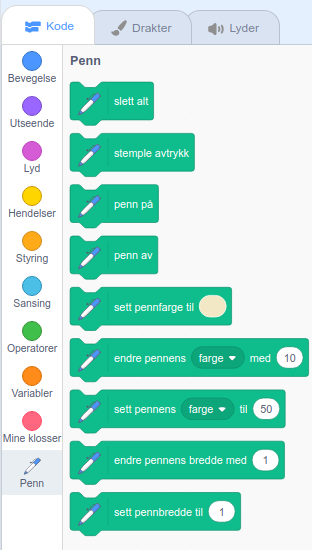

To use the Pen blocks in Scratch, you need to add the **Pen extension**.

+ Klikk på **Hent tilleggsfunksjon**-knappen i nedre venstre hjørne.

+ Klikk på **Penn**-utvidelsen for å legge den til.

+ Penn-delen vises deretter nederst på blokk-menyen.

