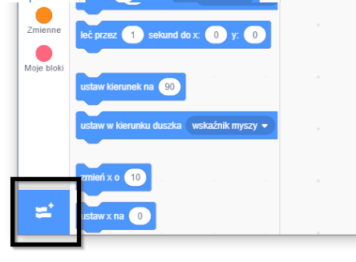
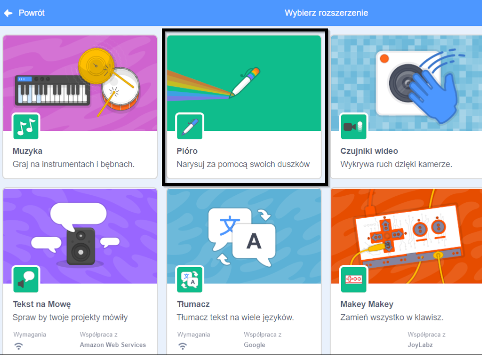
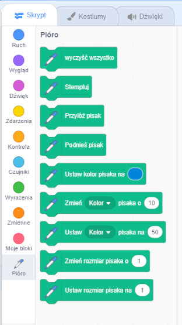

Aby używać bloków pióra w Scratch, musisz dodać **rozszerzenie pióra**.

+ Kliknij na przycisk **Dodaj rozszerzenie** w lewym dolnym rogu.

+ Kliknij rozszerzenie **Pióro** aby je dodać.

+ Sekcja Pióro pojawi się na dole menu bloków.

