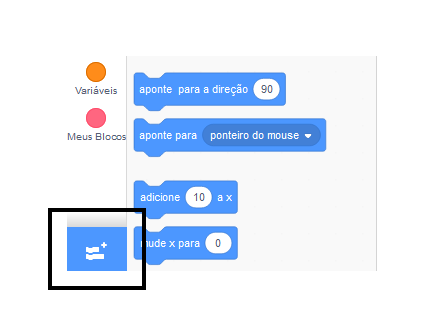
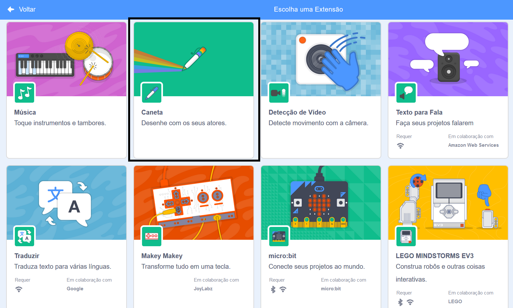
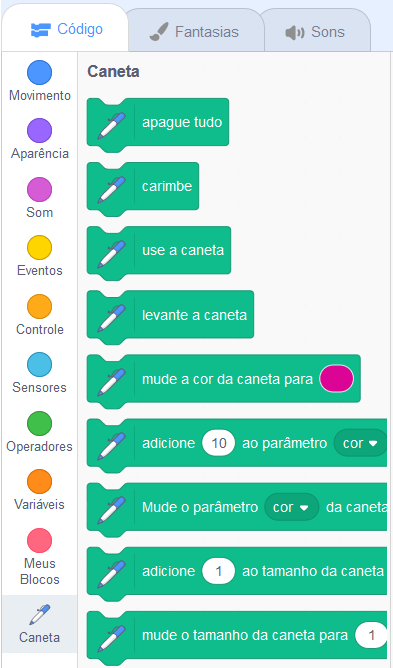

To use the Pen blocks in Scratch, you need to add the **Pen extension**.

+ Clique no botão **Adicionar extensão** no canto inferior esquerdo.

+ Clique na extensão **Caneta** para adicioná-la.

+ A seção Caneta aparece na parte inferior do menu de blocos.

