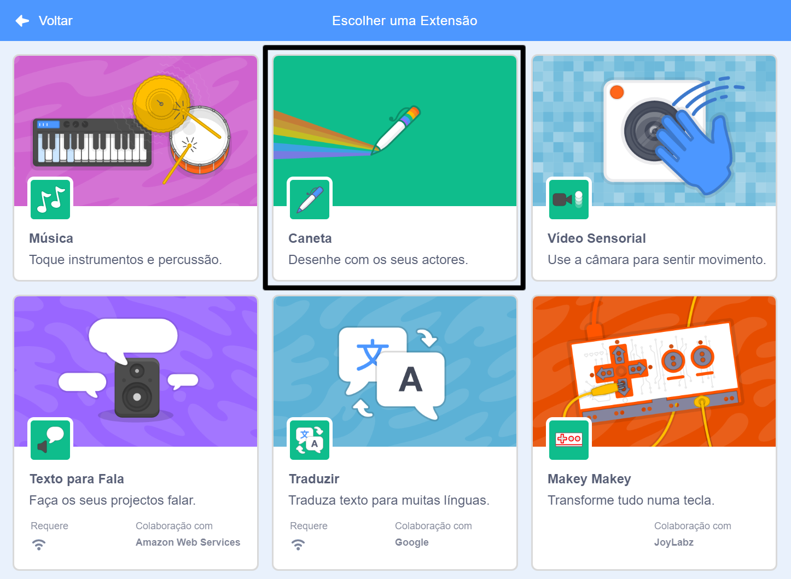
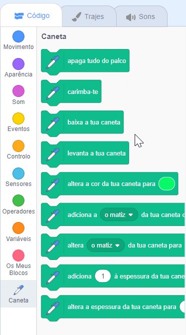

Para usar os blocos da Caneta no Scratch, precisas de adicionar a extensão **Caneta**.

+ Clica no botão **Adicionar extensão** no canto inferior esquerdo.

+ Clica na extensão **Caneta** para adicioná-la.

+ A categoria Caneta aparece então ao fundo da lista das categorias de blocos.

