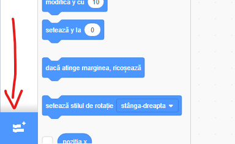
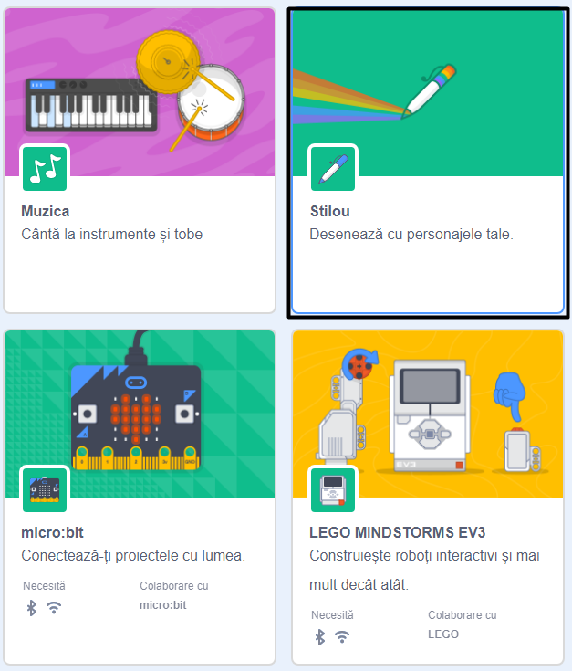
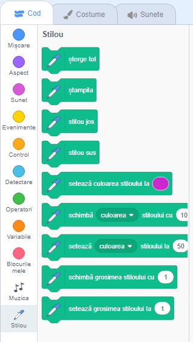

To use the Pen blocks in Scratch, you need to add the **Pen extension**.

+ Dă click pe butonul **Adaugă o extensie** în colțul din stânga jos.

+ Dă click pe extensia **Stilou** pentru a o adăuga.

+ Secțiunea Stilou va apărea apoi în partea de jos a meniului blocurilor.

