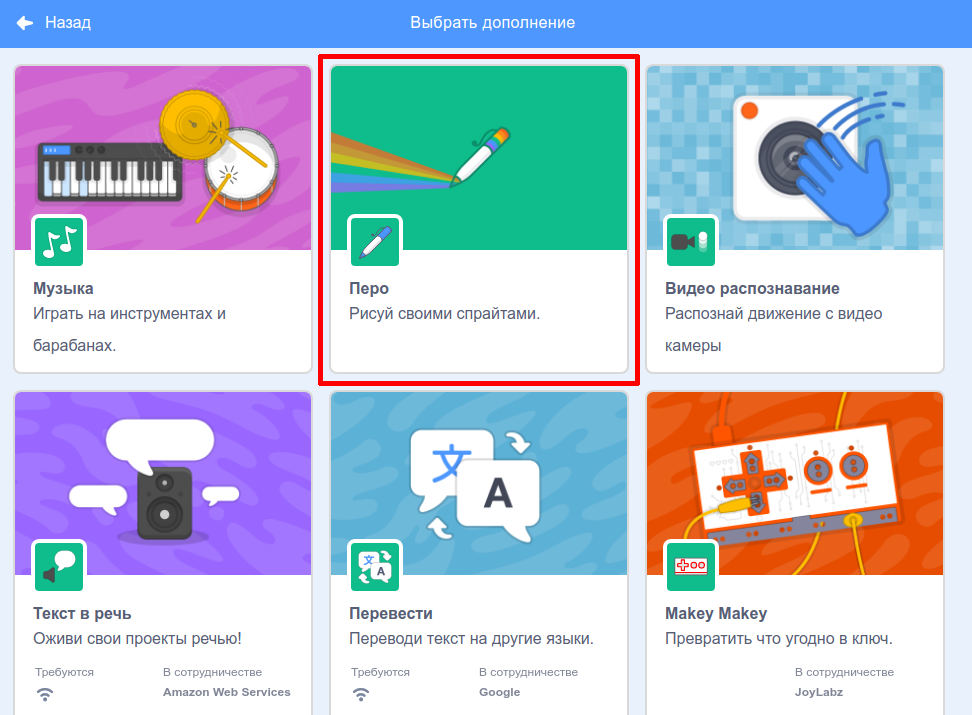

Чтобы использовать блоки Пера в Scratch, тебе нужно добавить расширение **Перо**.

+ Нажми кнопку **Добавить расширение** в левом нижнем углу.

+ Нажми на расширение **Перо**, чтобы добавить его.

+ Раздел «Перо» появится в меню блоков внизу.

