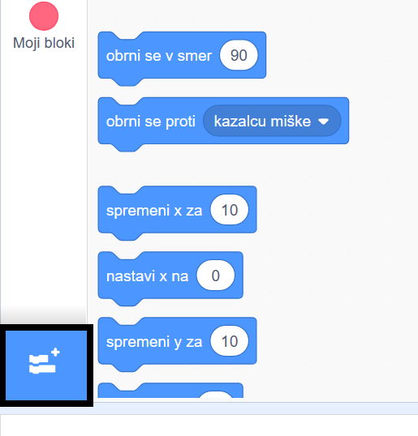
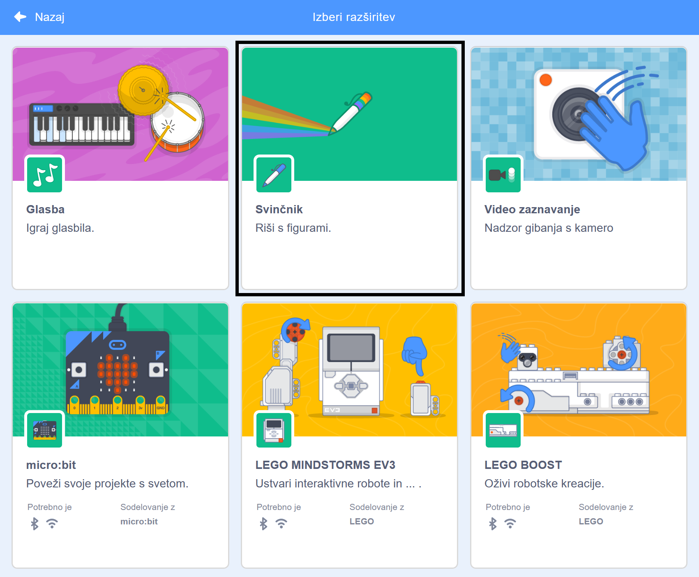
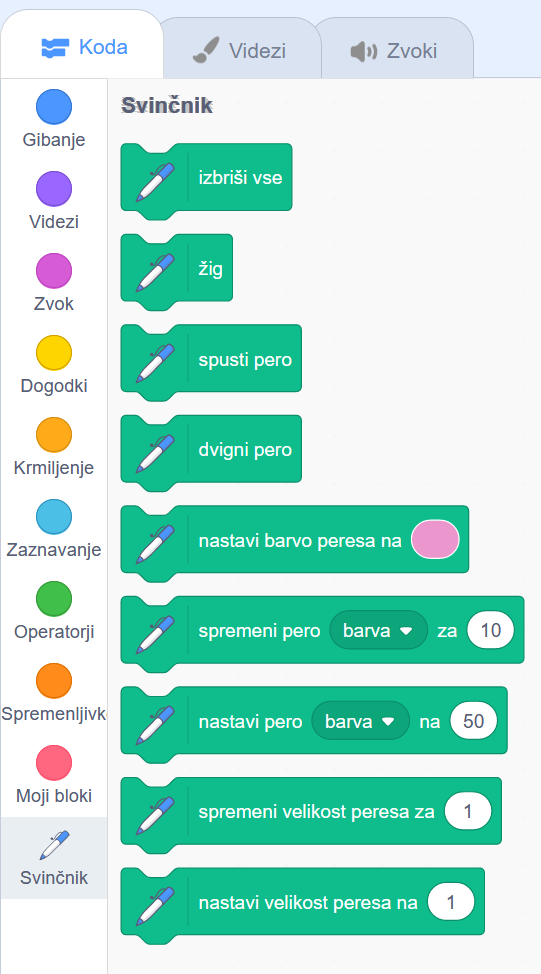

Da bi v Scratchu uporabil Svinčnik bloke, moraš dodati **razširitev Svinčnik**.

+ V spodnjem levem kotu kliknite gumb **Dodaj razširitev**.

+ Za dodajanje klikni na razširitev **Svinčnik**.

+ Nato se na dnu menija blokov prikaže oddelek Svinčnik.

