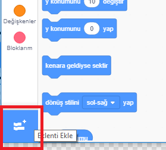
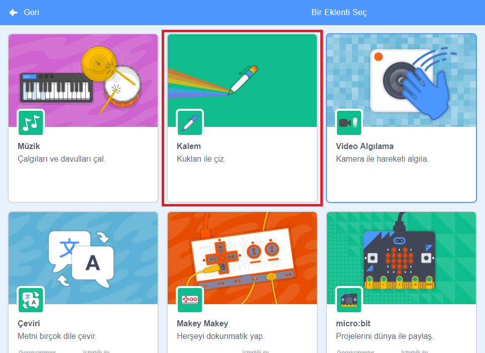
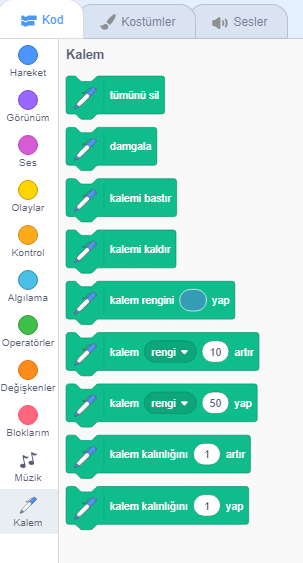

Scratch'ta Kalem blokları kullanmak için **Kalem uzantısını** eklemeniz gerekir.

+ Sol alt köşedeki **Eklenti Ekle** düğmesine tıklayın.

+ Eklemek için **Kalem** uzantısına tıklayın.

+ Kalem uzantısı Kod menüsünün altında belirir.

