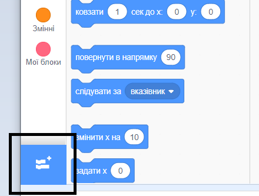
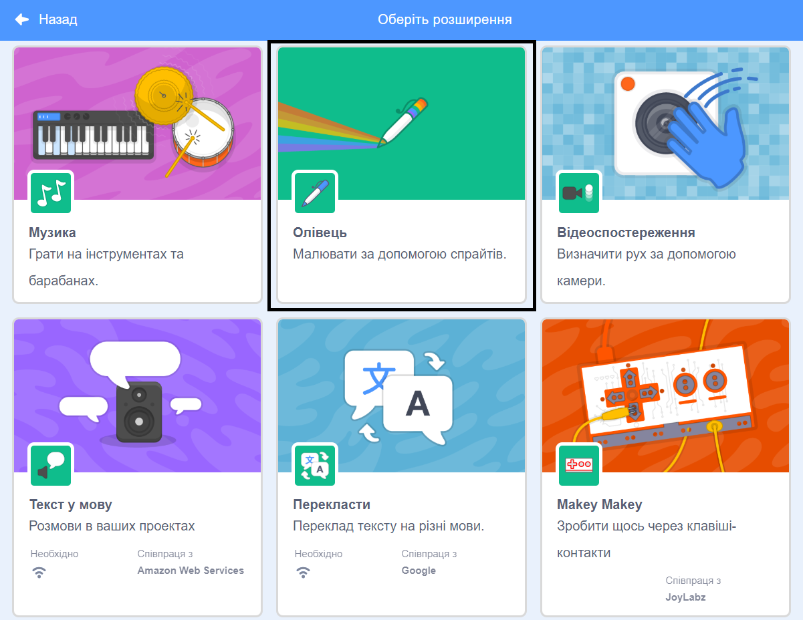
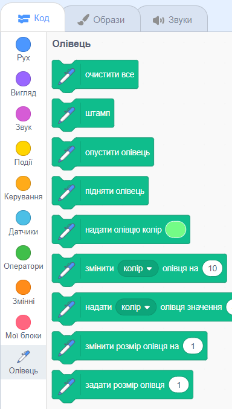

Для використання блоків Олівець у Скретч потрібно додати розширення **Олівець**.

+ Натисни на кнопку **Додати розширення** у лівому нижньому куті.

+ Натисни на розширення **Олівець**, щоб додати його.

+ Розділ Олівець з’явиться у меню блоків знизу.

